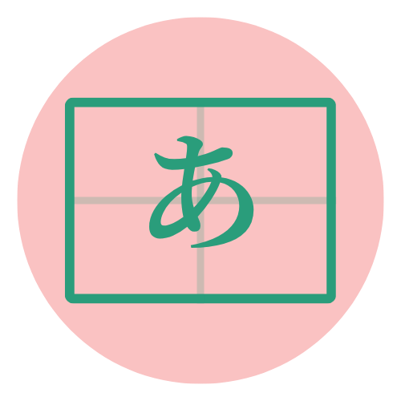

# 🇯🇵 4B-EBook — Learn Japanese

<div align="center">



**A comprehensive, interactive Japanese learning application built with Next.js 15, featuring lessons, alphabet learning, quizzes, and cultural insights.**

*Developed by the amazing students of 4B Class as part of their Foreign Language subject project at OLSHCO.*

[](https://github.com/4b-class/4b-ebook)
[](https://nextjs.org/)
[](https://reactjs.org/)
[](https://www.typescriptlang.org/)
[](https://tailwindcss.com/)

[Features](#-features) • [Installation](#-getting-started) • [Lessons](#-lesson-content) • [Alphabet](#-alphabet-learning) • [Development](#-development)

---


### 🖥️ Application Preview


*Interactive Japanese learning interface with lessons, alphabet flashcards, and quizzes*

</div>

## ✨ Features

### 📚 **Interactive Lessons**
- **9 Comprehensive Lessons**: From basic introductions to advanced grammar
- **Vocabulary Building**: Essential Japanese words with audio pronunciation
- **Grammar Explanations**: Detailed grammar points with examples
- **Cultural Notes**: Insights into Japanese culture and traditions
- **Interactive Quizzes**: Test your knowledge with multiple-choice and fill-in-the-blank questions
- **Progress Tracking**: Visual progress indicators for each lesson

### 🔤 **Alphabet Learning**
- **Hiragana Flashcards**: Interactive flashcard system for learning Japanese characters
- **Audio Pronunciation**: Text-to-speech for proper pronunciation
- **Visual Learning**: 3D flip cards with character, romaji, and examples
- **Navigation**: Easy navigation between characters
- **Learning Tips**: Helpful tips for mastering Japanese characters

### 🎯 **Practice & Assessment**
- **Vocabulary Quizzes**: Test your vocabulary knowledge
- **Grammar Quizzes**: Practice grammar concepts
- **Interactive Elements**: Engaging quiz formats
- **Instant Feedback**: Immediate results and explanations

### 🎨 **Modern UI/UX**
- **Responsive Design**: Works perfectly on desktop, tablet, and mobile
- **Pink Theme**: Beautiful, consistent color scheme (#E07A7A)
- **Custom Icons**: Lucide React icons for each lesson topic
- **Smooth Animations**: Polished user experience
- **Accessibility**: Built with accessibility in mind

## 🚀 Getting Started

### Prerequisites

- **Node.js**: Version 18.0 or higher
- **npm**: Version 8.0 or higher
- **Modern Browser**: Chrome, Firefox, Safari, or Edge

### Installation

1. **Clone the repository**
   ```bash
   git clone https://github.com/your-username/4b-ebook.git
   cd 4b-ebook
   ```

2. **Install dependencies**
   ```bash
   npm install
   ```

3. **Run the development server**
   ```bash
   npm run dev
   ```

4. **Open your browser**
   Navigate to [http://localhost:3000](http://localhost:3000)

### Build for Production

```bash
# Build the application
npm run build

# Start the production server
npm start
```

## 📁 Project Structure

```
4b-ebook/
├── public/                 # Static assets
│   ├── icon.png           # App icon
│   ├── 4bclasspic.jpeg    # Class photo for about page
│   └── og-image.svg       # Open Graph image
├── src/
│   ├── app/               # Next.js App Router pages
│   │   ├── about/         # About page
│   │   ├── alphabet/      # Alphabet learning page
│   │   ├── lessons/       # Lessons pages
│   │   │   ├── [id]/      # Dynamic lesson pages
│   │   │   └── page.tsx   # Lessons list
│   │   ├── quizzes/       # Quiz pages
│   │   ├── globals.css    # Global styles
│   │   ├── layout.tsx     # Root layout
│   │   └── page.tsx       # Home page
│   ├── components/        # Reusable components
│   │   ├── AppFrame.tsx   # Main app wrapper
│   │   ├── DashboardChrome.tsx # Sidebar navigation
│   │   ├── FloatingNav.tsx # Top navigation
│   │   └── FloatingQuizCTA.tsx # Quiz call-to-action
│   └── data/              # Data files
│       ├── alphabet.ts    # Hiragana/Katakana data
│       └── lessons.ts     # Lesson content
├── package.json           # Dependencies and scripts
├── next.config.ts         # Next.js configuration
├── tailwind.config.js     # Tailwind CSS configuration
└── tsconfig.json          # TypeScript configuration
```

## 📖 Lesson Content

### **Lesson 1: Introductions, Pronouns, and Basic Grammar**
- Basic greetings and introductions
- Personal pronouns (わたし, あなた, etc.)
- The particle は (wa) and です (desu)
- Cultural note: Japanese politeness levels

### **Lesson 2: Demonstratives, Everyday Objects, and Possession**
- Demonstrative pronouns (これ, それ, あれ)
- Possessive particle の (no)
- Common everyday objects
- Cultural note: Japanese gift-giving culture

### **Lesson 3: Places & Locations**
- Location vocabulary
- Direction words
- Asking for directions
- Cultural note: Japanese addressing system

### **Lesson 4: Daily Activities, Time, and Basic Conversations**
- Time expressions
- Daily activities
- Basic conversation patterns
- Cultural note: Japanese punctuality

### **Lesson 5: Going Places & Time Expressions**
- Transportation vocabulary
- Time expressions (じ, ふん, はん)
- Days of the week and months
- Cultural note: Japanese transportation system

### **Lesson 6: Daily Activities, Food, and Basic Verbs**
- Action verbs (たべます, のみます, etc.)
- Food vocabulary
- Particles を (o) and で (de)
- Cultural note: Japanese food culture

### **Lesson 7: Family, Giving and Receiving, Tools & Offers**
- Family vocabulary
- Giving and receiving verbs
- Making offers and requests
- Cultural note: Japanese family structure

### **Lesson 8: Adjectives & Descriptions**
- I-adjectives and Na-adjectives
- Describing people and things
- Adjective conjugations
- Cultural note: Japanese aesthetic values

### **Lesson 9: Existence (Imasu/Arimasu), Locations, and Positions**
- Existence verbs (います, あります)
- Position words (うえ, した, なか, etc.)
- Location particles
- Cultural note: Japanese spatial concepts

## 🎯 Learning Features

### **Interactive Elements**
- **Audio Pronunciation**: Text-to-speech for Japanese words and characters
- **Progress Tracking**: Visual indicators for lesson completion
- **Quiz System**: Multiple question types with instant feedback
- **Cultural Insights**: Real-world context for language learning

### **Alphabet Learning**
- **Hiragana Flashcards**: 46 basic characters with examples
- **3D Flip Cards**: Interactive learning experience
- **Audio Support**: Proper pronunciation for each character
- **Navigation**: Easy character browsing

### **Responsive Design**
- **Mobile-First**: Optimized for all screen sizes
- **Touch-Friendly**: Large buttons and touch targets
- **Fast Loading**: Optimized performance
- **Accessibility**: Screen reader compatible

## 🛠️ Technology Stack

### **Frontend**
- **Next.js 15**: React framework with App Router
- **React 19**: Latest React features
- **TypeScript**: Type-safe development
- **Tailwind CSS 4**: Utility-first CSS framework

### **UI Components**
- **Lucide React**: Beautiful, customizable icons
- **Custom Components**: Tailored for Japanese learning
- **Responsive Design**: Mobile-first approach

### **Features**
- **Text-to-Speech**: Web Speech API for pronunciation
- **Progressive Web App**: Installable on mobile devices
- **SEO Optimized**: Meta tags and Open Graph support
- **Performance**: Optimized images and code splitting

## 🎨 Design System

### **Color Palette**
- **Primary**: #E07A7A (Pink)
- **Secondary**: #FEE2E2 (Light Pink)
- **Background**: #F8FAFC (Slate 50)
- **Text**: #0F172A (Slate 900)
- **Accent**: #10B981 (Emerald 500)

### **Typography**
- **Primary Font**: Geist Sans (Google Fonts)
- **Monospace**: Geist Mono (Google Fonts)
- **Japanese**: System fonts (Hiragino Sans, Yu Gothic, etc.)

### **Components**
- **Cards**: Rounded corners with subtle shadows
- **Buttons**: Pill-shaped with hover effects
- **Navigation**: Clean, minimal design
- **Icons**: Consistent Lucide React icons

## 📱 Browser Support

- **Chrome**: 90+
- **Firefox**: 88+
- **Safari**: 14+
- **Edge**: 90+

## 🚀 Deployment

### **Vercel (Recommended)**
1. Connect your GitHub repository to Vercel
2. Deploy automatically on every push
3. Custom domain support available

### **Netlify**
1. Build command: `npm run build`
2. Publish directory: `.next`
3. Deploy with continuous integration

### **Self-Hosting**
1. Build the application: `npm run build`
2. Start the server: `npm start`
3. Configure reverse proxy (nginx/Apache)

## 🤝 Contributing

We welcome contributions from the 4B Class community! Here's how you can help:

### **Adding Content**
- New vocabulary words
- Additional grammar explanations
- Cultural notes and insights
- Quiz questions

### **Improving Features**
- UI/UX enhancements
- Performance optimizations
- Accessibility improvements
- Mobile responsiveness

### **Bug Reports**
- Use GitHub Issues to report bugs
- Include steps to reproduce
- Provide browser and device information

## 📄 License

This project is developed by 4B Class students for educational purposes. All content is created for learning Japanese language and culture.

---


## 👥 Credits

### **Development Team**
**4B Class Students** • **Teachers & Mentors** • **OLSHCO**

### **Special Thanks**
Japanese language teachers • Design mentors • Technical advisors

---

**Made with ❤️ by 4B Class for Japanese language learning**

*"The fun way of learning Japanese is here!"*

[](https://github.com/avnixm/foreign-language)
[](https://fl.cieloes.com)

